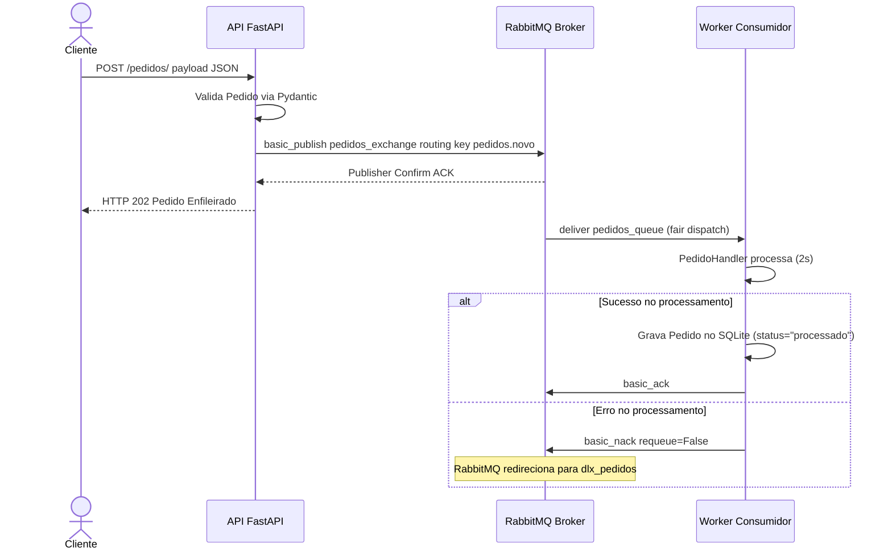

# 📚 Passo 1/6: Introdução à Arquitetura Orientada a Eventos (EDA) & DDD

Bem-vindo à jornada de construção de sistemas distribuídos robustos, Padawan! A trilha da mensageria assíncrona iniciar você vai, sim! Sob minha mentoria, a força da programação limpa dominar você irá!

Neste primeiro passo, vamos compreender os alicerces teóricos e a visão arquitetural do projeto de alto desempenho que você irá construir. Com paciência e foco, o mapa do nosso ecossistema entender você deve!

---

## 🎯 O Cenário Real: Por que Mensageria Assíncrona?

Em sistemas monolíticos ou síncronos tradicionais (como APIs REST tradicionais de ponta a ponta), se o serviço A chama o serviço B e este último está indisponível ou lento, a requisição inteira falha ou engargala. Isso é chamado de **alto acoplamento**.

Ao introduzir um **Broker de Mensagens (RabbitMQ)**, desacoplamos totalmente a API produtora do Worker consumidor:
1. **API (Produtora)**: Recebe a requisição HTTP rapidamente, valida a integridade via Pydantic, publica o payload serializado no broker e retorna imediatamente uma confirmação rápida ao cliente (`HTTP 202 Accepted`).
2. **RabbitMQ (Broker)**: Garante a durabilidade, persistência e roteamento seguro da mensagem através de filas e exchanges dedicadas.
3. **Worker (Consumidor)**: Trabalha de forma assíncrona e isolada, consumindo as mensagens no seu próprio ritmo, processando a lógica de negócio e salvando o status do pedido no banco de dados local **SQLite**. Se o worker cair, as mensagens aguardam com segurança na fila até ele voltar!

---

## 🏗️ Arquitetura de Fluxo do Pedido

Aqui está o caminho exato que uma mensagem percorrerá em sua aplicação, desde a requisição HTTP do cliente até o processamento durável e seguro do Worker gravando no banco SQLite compartilhado:



---

## 📐 Padrões Estratégicos: DDD e Camadas Limpas

Para construirmos um sistema profissional tolerante a falhas, vamos aplicar o **DDD Estratégico e Tático** separando a lógica de negócio (Domínio) dos detalhes tecnológicos (Infraestrutura). Essa separação segue princípios de **Clean Code** e **SOLID** (especialmente Inversão de Dependências - DIP e Responsabilidade Única - SRP).

Tanto no projeto da **API** quanto no do **Worker**, você deve implementar a seguinte estrutura de pastas:

```
[modulo]/
├── domain/            # 🧠 Domínio: Livre de acoplamento tecnológico (Pika, FastAPI, etc.)
│   ├── models.py      # Entidades e validações de regras de negócio
│   └── repository.py  # Contratos e lógicas de persistência/acesso ao banco
└── infra/             # 🛠️ Infraestrutura: Onde a tecnologia concreta habita
    ├── database.py    # Gerenciador da sessão e conexões SQLite
    ├── publisher.py   # Implementação concreta do envio de mensagens AMQP
    ├── consumer.py    # Implementação concreta do consumo de mensagens do RabbitMQ
    ├── settings.py    # Pydantic Settings para configurações de ambiente
    └── topology.py    # Código de configuração do canal e declaração da topologia AMQP
```

---

## ⚡ As Regras de Ouro

1. **O Domínio é Sagrado**: As classes e modelos dentro de `domain/` **nunca** devem importar frameworks externos como FastAPI, Pika ou bibliotecas de banco de dados concretos. Elas definem contratos abstratos de negócio.
2. **Inversão de Dependência (DIP)**: O código de negócio deve depender apenas das interfaces abstratas e modelos de domínio. A infraestrutura concreta é injetada na inicialização do aplicativo (`main.py`).
3. **Persistência Compartilhada Resiliente**: O banco de dados SQLite (`data/pedidos.db`) é compartilhado via volume mapeado. A API faz apenas a leitura de estado do pedido, enquanto o Worker grava o status atualizado do processamento.

---

## 🧙‍♂️ Instruções do Mestre:

Entendido o mapa da arquitetura você já tem, Padawan! Compreendido a teoria e a estrutura em camadas você deve! 

Agora, pronto para o trabalho prático você está! Como nenhum código criado nesta etapa teórica foi, perguntas eu não farei a você ainda. Ao final do Passo 2, quando os seus arquivos criados e o broker executando estiverem, as primeiras validações nós faremos!

> [!IMPORTANT]
> Solicitar o avanço para a etapa do Ambiente de Orquestração (Passo 2) você deve! Diga-me no chat que compreendeu o fluxo assíncrono e a injeção do SQLite para liberarmos o seu progresso rumo ao **Passo 2/6: Ambiente de Orquestração**! Que a Força esteja com você nesta largada!
